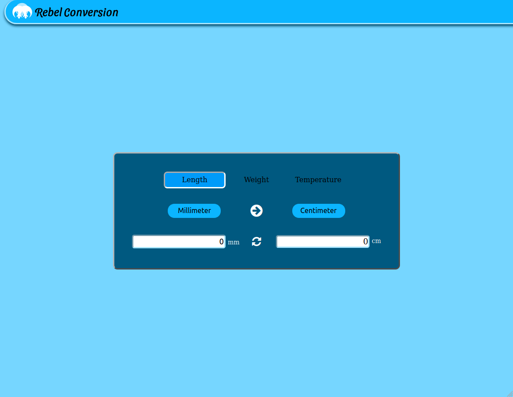

# Rebel Conversion

Rebel Conversion is an online unit converter for length, weight and temperature.

## Functions

 1. Conversion between length unit types:
    1. Millimeter 
    2. Centimeter
    3. Inch 
    4. Feet 
    5. Meter 
    6. Kilometer 
2. Conversion between weight unit types:
    1. Milligram 
    2. Gram 
    3. Ounce 
    4. Pound 
    5. Kilogram
3. Conversion between temperature unit types::
    1. Fahrenheit
    2. Celsius
    3. Kelvin

## Fuctionality

1. The Converter take a unit type absolute numerical input, and displays an opposing unit type converted value.
2. Conversion is evaluated between unit types of length, weight, and temperature.
3. Selecting the length conversion will initialize a conversion from millimeter to centimeter with a value of zero.
4. Selecting the weight conversion will initialize a conversion from milligram to gram with a value of zero.
5. Selecting the temperature conversion will initialize a conversion from fahrenheit to celsius with a value of zero.
6. A guided arrow shows the direction of conversion between unit types.
7. Selecting a unit type will present additional options for conversion. 
8. When an additional type options is selected, the conversion unit along with it's symbol changes and an update to the converted input is displayed.
9. Additional options can be selected from the list of unit types for any direction.
10. The Converter only converts positive numeric input.
11. The refresh button will initialize the input and display values to zero. 

## Implimentation

The following languages, framework and libraries were used in the converter creation:
1. React 
2. Redux 
3. Scss
4. Html5
5. Css3
    1. Flex-box (for layout and responsiveness)
6. JavaScript ES6
7. [create-react-app](https://github.com/facebook/create-react-app)

## ScreenShot 

## Credit

+ created by [Nial Hope](https://github.com/nhope123)
  + [Portfolio](https://nhope123.github.io/)

## License

Rebel Conversion is an open source software licensed as [GNU General Public License v3.0](LICENSE)
